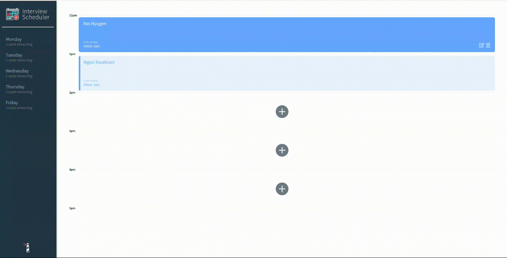
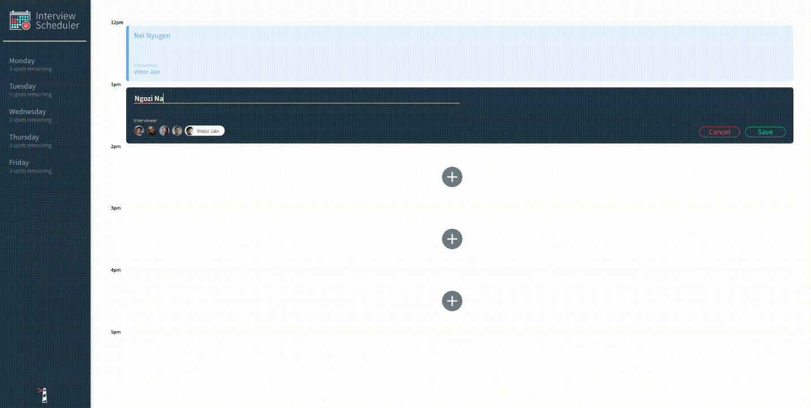
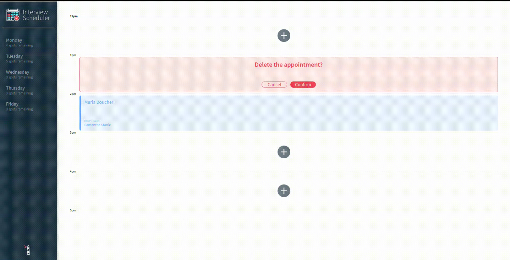

# Interview Scheduler

Using the latest tools and techniques, we will build and test a React application that allows users to book and cancel interviews. We combine a concise API with a WebSocket server to build a real-time experience.

## Setup

Install dependencies with `npm install`.

## Running Webpack Development Server

```sh
npm start
```

## Running Jest Test Framework

```sh
npm test
```

## Running Storybook Visual Testbed

```sh
npm run storybook
```

## Final Product

### - Main Page
This is the page showing all your appointments.



### - Edit Function
You can add or change your appointments by this function.



### - Delete Function
You can delete your appointments by this function.




## Dependencies

- axios
- classnames
- normalize.css
- react